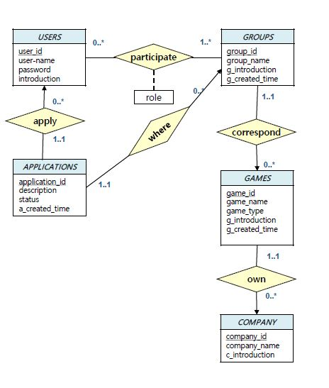
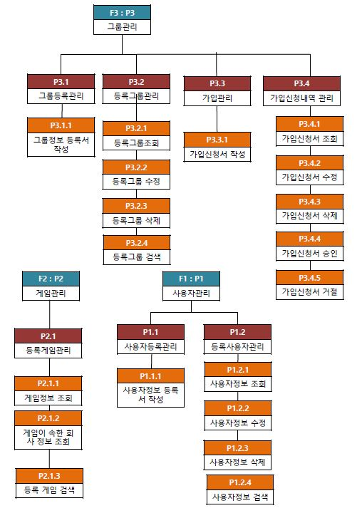

# GAME MATCHING

온라인 게임을 할 때, 팀이 필요한 게임의 경우 함께 게임할 다른 플레이어들을 찾아볼 수 있도록 하는 사이트.  
<b>Database Design & ERD 및 구현</b>에 초점을 두고 진행한 프로젝트.
  
<i><b>Language: PHP, DB: MariaDB</b></i>

### 사용자 관리
사이트를 이용할 수 있는 사용자들에 대한 정보를 관리


### 게임 관리
생성될 그룹 혹은 생성된 그룹이 속하는 게임 정보를 관리.


### 그룹 관리
여러 플레이어들이 참여하여 팀을 이룰 수 있는 그룹 정보를 관리


### ERD



### 프로세스 계층도



### Database Implementation

<b>Users</b>

```sql
    CREATE TABLE users (
        User_id mediumint NOT NULL AUTO_INCREMENT,
        User_name char(30) NOT NULL,
        Password blob NOT NULL,
        Introduction text NOT NULL,
        PRIMARY KEY(user_id)
    );
```

<br>
<b>Games</b>

```sql
    CREATE TABLE games (
        game_id mediumint NOT NULL AUTO_INCREMENT,
        game_name varchar(30) NOT NULL,
        Game_type varchar(30) NOT NULL,
        G_created_time timestamp NOT NULL,
        G_introduction text NOT NULL,
        Company_id mediumintNOT NULL,
        PRIMARY KEY(game_id),
        Foreign key(company_id) references company(company_id)
    );
```

<br>
<b>Companies</b>

```sql
    CREATE TABLE companies (
        company_id mediumint NOT NULL AUTO_INCREMENT,
        Company_name varchar(25) NOT NULL,
        C_introduction text NOT NULL,
        PRIMARY KEY(company_id)
    );
```

<br>
<b>Groups</b>

```sql
    CREATE TABLE groups (
        group_id mediumint NOT NULL AUTO_INCREMENT,
        group_name char(30) NOT NULL,
        Game_id mediumint NOT NULL,
        Gr_created_time timestamp NOT NULL,
        Gr_introduction text NOT NULL,
        PRIMARY KEY(group_id),
        FOREIGN KEY(game_id) references games(game_id)
    );
```

<br>
<b>Applications</b>

```sql
    CREATE TABLE applications (
        application_id mediumint NOT NULL AUTO_INCREMENT,
        user_id mediumint NOT NULL,
        group_id mediumint NOT NULL,
        description text NOT NULL,
        A_created_timetime stamp NOT NULL,
        Status varchar(15) NOT NULL,
        PRIMARY KEY(application_id),
        FOREIGN KEY(group_id) references groups(group_id),
        FOREIGN KEY(user_id) references users(user_id)
    );
```

<br>
<b>Belongs</b>

```sql
    CREATE TABLE belongs (
        user_id mediumint NOT NULL,
        Group_id mediumint NOT NULL,
        role varchar(20) NOT NULL,
        B_created_timetimestamp NOT NULL,
        PRIMARY KEY(user_id, group_id),
        FOREIGN KEY(group_id) references groups(group_id),
        FOREIGN KEY(user_id) references users(user_id)
    );
```
